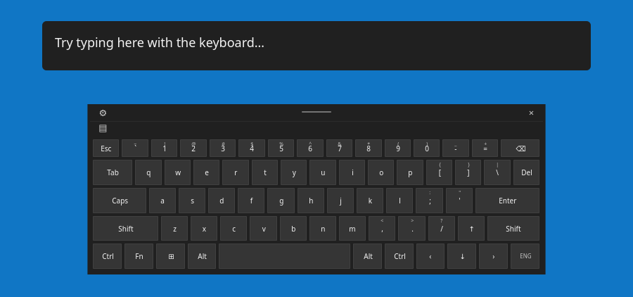

<!-- SPDX-FileCopyrightText: 2026 RobbyBobby77 -->
<!-- SPDX-License-Identifier: CC0-1.0 -->

# Plasma Keyboard — Windows Touch

A fork of [KDE Plasma Keyboard](https://invent.kde.org/plasma/plasma-keyboard), based on **v6.7.5**, with a dark desktop layout inspired by the Windows touch keyboard.



The keyboard retains Plasma's Qt Virtual Keyboard / Wayland input method integration. The new layout has charcoal rectangular keys, compact spacing, a short number row, wide Tab/Caps/Shift/Enter keys, an empty spacebar, and an ENG language key. A header contains settings, compact/full-width, hide, and a drag handle.

- English US and UK desktop layouts (hold the UK # key for backslash/pipe). Other languages and numeric/password layouts retain upstream layouts with the dark style.
- Ctrl and Alt latch for the next key. Both copies show the same state. Tapping again cancels the modifier; completing a shortcut clears it.
- Fn toggles the number row to F1–F12. Shift and Caps use Qt's existing shift handler.
- Escape, Tab, Backspace, Delete, Enter and arrow keys send real key events.
- The Plasma-logo Super key opens the application launcher directly, including when Shift/Ctrl/Alt is active.
- The compact panel can be dragged within its input surface. The header's keyboard button switches between compact and full-width modes.

Windows dictation/voice input is not implemented. The current UI omits the microphone button. Keyboard size is responsive; this is a Windows-inspired design, not a pixel-exact Windows port.

## Separate install identity

The fork installs alongside upstream: binary `plasma-keyboard-windows`, desktop entry `org.kde.plasma.keyboard.windows.desktop`, settings module `kcm_plasmakeyboardwindows`, configuration `plasmakeyboardwindowsrc`, layout directory `share/plasma/keyboard-windows`, QML modules `org.kde.plasma.keyboard.windows*`, and style `WindowsTouch`.

## Build and preview locally

Dependencies: a C++20 compiler, CMake, Extra CMake Modules >= 6.26, Qt >= 6.10 with VirtualKeyboard and WaylandClient (including private headers), KDE Frameworks >= 6.26 (CoreAddons, I18n, KCMUtils, Config, Crash), PlasmaQuick >= 6.7, libxkbcommon, Wayland and wayland-protocols. Tests additionally need Qt Test and QuickTest. Qt WaylandCompositor enables upstream's compositor tests when installed.

```sh
cmake -S . -B build -DCMAKE_BUILD_TYPE=Release \
  -DCMAKE_INSTALL_PREFIX="$PWD/install" -DBUILD_TESTING=ON
cmake --build build --parallel
QT_QPA_PLATFORM=offscreen ctest --test-dir build --output-on-failure
cmake --install build
./scripts/run-local.sh --preview
```

This creates a local installation and opens a standalone window with a text field. To save a reproducible render:

```sh
QT_QPA_PLATFORM=offscreen QT_QUICK_BACKEND=software \
  ./scripts/run-local.sh --preview-screenshot "$PWD/keyboard-preview.png"
```

Override `PLASMA_KEYBOARD_WINDOWS_PREFIX` to run an installation at another prefix. The wrapper sets the QML and data paths for that prefix.

## Install as a Plasma input method

For a system installation on a compatible Plasma Wayland desktop:

```sh
cmake -S . -B build-system -DCMAKE_BUILD_TYPE=Release \
  -DCMAKE_INSTALL_PREFIX=/usr -DBUILD_TESTING=OFF
cmake --build build-system --parallel
sudo cmake --install build-system
```

Open **System Settings → Keyboard → Virtual Keyboard** and select **Plasma Keyboard — Windows Touch**. For this fork's configuration, run `kcmshell6 kcm_plasmakeyboardwindows` or use the header gear.

The normal executable needs KWin's input-method privileges and cannot work as an input method when simply launched from a terminal. Use `--preview` to try the layout without changing your desktop's selected keyboard. KWin normally opens it for touch interaction with text fields; `KWIN_IM_SHOW_ALWAYS=1` at login enables mouse-triggered display as described upstream.

To return to the stock keyboard, select it again on the same System Settings page.

A separate Flatpak manifest is also included, with application ID `org.kde.plasma.keyboard.windows`:

```sh
flatpak-builder --user --install --force-clean build-flatpak .flatpak-manifest.json
```

## Validation

The v6.7.5 fork was built on CachyOS with Qt 6.11.2, Frameworks 6.30, and Plasma 6.7.5. Automated checks cover:

- AppStream metadata.
- Actual Qt input-panel typing/backspace, Shift/Caps, Ctrl+A selection and modifier clearing, F1/F12 switching, cursor movement, UK shifted symbols, and layout bounds.
- Header controls, dragging and disabling drag in full-width mode.
- Native shortcut mapping against US, UK and French keymaps, including Ctrl+C, Ctrl+A, Ctrl+Shift+Left, Alt+F4 and avoiding accidental Shift.

The screenshot is rendered by the compiled application. The real KWin input-method session and Flatpak packaging have not been tested; the upstream compositor test requires the optional Qt WaylandCompositor module. Global desktop shortcuts such as Alt+Tab depend on compositor handling; the explicit application-launcher button uses Plasma's D-Bus API.

## License

Upstream copyright notices and licenses are preserved. New layout and UI code is GPL-3.0-only; the native shortcut helper is LGPL-2.1-or-later. See the file headers and `LICENSES/`.
